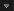
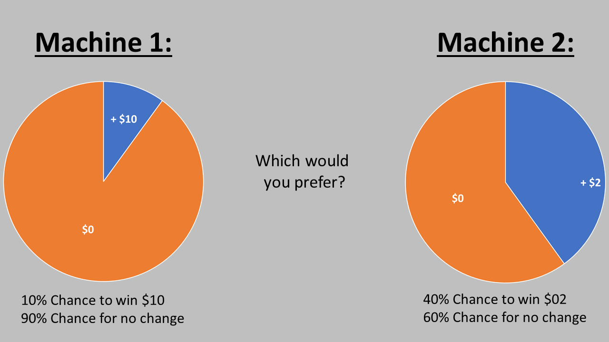
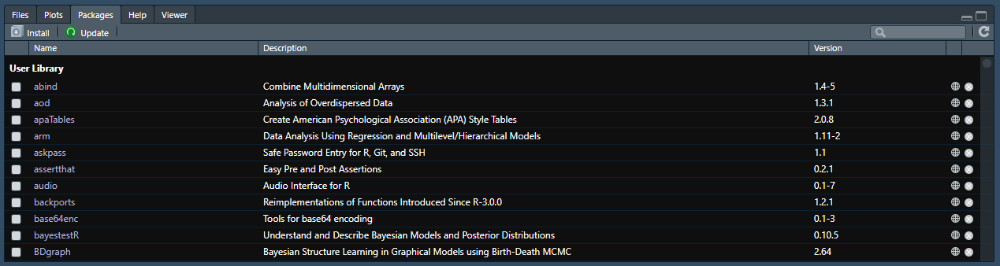
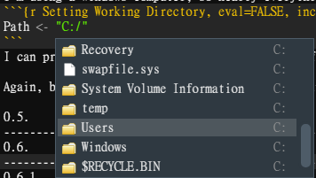
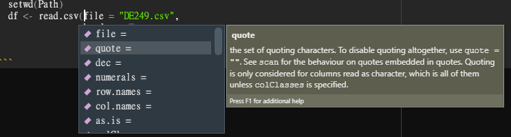
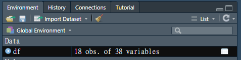
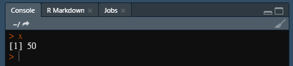
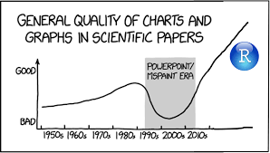
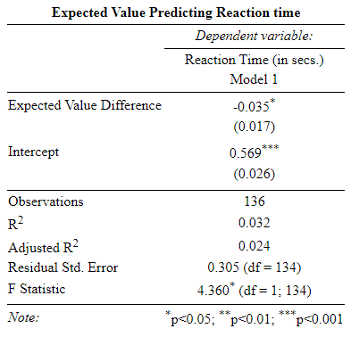

```{r, echo=FALSE}
knitr::opts_chunk$set(error = TRUE)
```

# Introduction

Everything sticks better when you're coding towards a goal. We remember the things we do better when they work towards a logical, progressive narrative, rather than a jumbled set of skills loosely thrown together. As such, we're all going to be working together towards answering a few specific questions with this dataset: 

TODAY'S QUESTIONS:

  1.) Does sampling probability lead people to choose safe choices more frequently?   
  2.) Do people make choices faster when deciding within a single domain versus domains including both losses and gains?  
  3.) Do people make choices faster across different combinations of problem types and conditions?  
  4.) Does expected value predict response time?  
  5.) Does expected value influence the probability of choosing the safe option?  

Furthermore, I'm going to outline the stages that we can expect to see throughout that process. Some of these might be a little less meaningful if you don't have a solid statistical background, but you should nonetheless be able to follow along in practice, if not in theory. This **is not** an exercise in statistical knowledge; it **is** an exercise in coding, but the content just happens to be statistical. 


## An *R Markdown* Primer 

This is an ***R Markdown*** script. Much like a typical ***R script***, it contains code documenting your process, such that any other individual could reproduce your work. However, unlike typical *R scripts*, *R Markdown* allows us to narrate the process (much as I'm doing now). The different types of text (narration and code) usually appear in different colors so you can tell the difference; though, what color it appears as for you might differ based on your settings. 

A typical *R script* will interpret any text that you include as a command to be carried out, unless otherwise marked by a hashtag (#). The output will appear in your *R Studio Console Window*. By output, we just mean the product, sum, or status of whatever calculation or item you are asking R to compute or show for you. This is the style of coding that you were using on the bash and python days with visual code studio and spyder. 

*R Markdown* can be a little more complicated, but you also have a lot of control over how commands, text, and output are displayed. Ultimately, because of this additional control, I find *R Markdown* scripts more intuitive and easy to follow (though not everyone feels the same). The output of any commands you enter into an *R Markdown* script typically appears just below the script that created it. We can read it in the *Console* if we prefer, but it's nice having all the information we want in one window (this one, if you're reading this as a script). We can also minimize output and text that we don't want to look at in the moment by clicking on the arrow next to the line count on the left side of the window [  ].

In order to tell R when you want it to treat something as a command in *R Markdown*, you use these backtick (```) symbols (usually upper left corner of the keyboard) followed by "{r }". Below that, we enter the command(s) we want to run, and then we close it all out with those backticks again.
Next to "{r }", we can add descriptions of what is happening within that block. Let's look at this example below :
```{r Example 1}
# This is an example of a command. I use the three little dash marks, followed by {r } to let R know I want to give it a command. I can describe what the command is after the r (Like I did with "Example"), though, it's not necessary to do so. Also, notice, much like a typical *R script*, I can use a # to let R know that this text should not be consider a command. If I were to press "Enter" and go down a line, I can have it start paying attention again and calculate the sum of 2 and 4.

Value <- 2 + 4
Value

# to calculate that line in *R Markdown*, I can press COMMAND + ENTER, or to run all of the commands within this block, I can press the green right facing arrow in the upper right corner of the block.
```

If you pressed the "*Run*" command [  ], hopefully you saw a little box pop up just below your block that said "[1] 6". If you want to export the output, whatever it may be, to a new window, simply click the first icon of the the three in the upper right corner of the output box [  ].  To minimize, click the second [  ], and to delete, press the third [  ]. Note that deleting the output does not affect the related code.

Also of note, the down-facing arrow (second icon in the upper right corner of the code block) will tell R "Run all of the blocks of command that I have before this block" [  ]. It can be helpful if you make a mistake and don't want to rerun all of the previous blocks one by one to get back to where you were. It also makes your code very easy for other people to run. They can quite literally do it with the click of a button! If we click the cog icon in the same tray, we can access the output options and manipulate where output appears and what it looks like, but that's beyond the scope of this review [  ].  Let's go ahead and try it below; if you click on the "Run all" function for the Example 3 block, Example 1 and Example 2 should rerun and run, respectively:
```{r Example 2}
(Value * 3) + 2
```

```{r Example 3}
(Value/10)
```
*R Markdown* scripts will allow us, once we are done, to compile all of our work, or "knit" it, and share it as either an interactive .pdf or .html document which others can follow. They are very helpful if you want to run a stat coding blog, or, say, teach a workshop on how to code in R. I'm not going to go much deeper into the setup of *R Markdown*, but I have included helpful references in the course materials for those interested.

Of note for those familiar with R, but new to *R Markdown*: A few functions work differently in *R Markdown*, relative to an *R script*. For example, in a typical *R script*, we could set our working directory using the *setwd()* function and it would remain the working directory until otherwise specified. *R Markdown* does not play nice with the *setwd* command for whatever reason, so I've found the simplest option is to just recall the file pathway whenever you want to load or save a file. The others aren't super relevant for this presentation, but something to keep in mind if anyone gets converted to the cult of *R Markdown*. Additional details about *R Markdown* and it's functionality can be found **[in this .pdf](https://github.com/TU-Coding-Outreach-Group/intro-to-coding-2021/blob/main/R/resources/Resource1.pdf)**, but aren't necessary for this bootcamp tutorial.

Now that we've got that out of the way, let's get started! 

```{r Removing Value, eval=TRUE, include =FALSE}
rm(Value)
```

## A Quick Reminder of the Study Design
In this study, participants were asked to make timed decisions between two sets of probabilistic outcomes. For example, participants may have been asked to choose which of the two would be preferable: a situation where they have a 10% chance of winning $10 dollars (and, necessarily, a 90% chance of winning nothing), or a 40% chance of winning $2 dollars (and a 60% chance of winning nothing). These problems differed in how much participants could win or lose and the probability of those outcomes. Additionally, participants completed this task twice: once following the summary just described and another time where they were not explicitly told the probabilities of winning or losing, but instead were tasked with sampling from the different outcomes to make their decision.



## What's a "Package"?

We've encountered packages, or something akin to packages, in the previous workshops. You can think of them as add-ons. If we start playing with R right out of the box, with no add-ons, it has a lot of useful tools. We call this ***Base R***. You can do almost anything you can think of with *Base R*, but it's not always the most efficient way to do things. Because R is open source, meaning it's free to use and collectively developed, users have programmed collection of shortcuts in the form of these packages. So, in that sense, each package just contains one or more commands not available in *Base R* (add-ons!).

Every new package is centralized in R's repository, so even though thousands of people are working on these things independently, you don't need to leave R to find them. Before they can be used, they must be installed, and you can do that pretty simply:
```{r Installing a package, eval=FALSE,include=TRUE, message=FALSE, warning=FALSE, error=FALSE}
  install.packages("PackageName")
```
Once a package is installed, it does not need to be installed again. Rerunning the code above will result in updating the given package. If you're using *R Studio*, you can also see a list of your packages and their associated descriptions in the 'Packages' Tab of your *Viewer Window*. 



However, just because a package is installed, it doesn't mean it's initialized. Sometimes different packages use the same commands. Sometimes packages take up a lot of disk space. For these reasons, R asks you to tell it what packages you want to use every time you start a new code. We're going to do that by specifying:
```{r Package Management, eval=FALSE,include=TRUE, message=FALSE, warning=FALSE, error=FALSE}
  library(PackageName)
```
Notice that we drop the quotation marks now. We just specify the (case-sensitive) package name and it let's R know we are planning on using that this session. If we ever want to explore the functions contained within a package in conjunction with examples, we can either go to **[the R documentation website](https://www.rdocumentation.org/)** or type '??PackageName' into the *Console*, which will then populate the *Help Tab* of the *Viewer Window* with information on the package. 

### Exercise 1
Install and load the following packages:  

  effects
  ggthemes
  plyr
  psych  
  report  
  skimr  
  stargazer  
  tidyverse  
  
```{r Exercise 1, code="'\n\n\n\n'", results=F}


  
```

[Click for solution](https://github.com/TU-Coding-Outreach-Group/intro-to-coding-2021/blob/main/R/solutions/ex1.r)

## How do I specify my Working Directory in R?

Like any other language or program, R needs to be told where the data that we'd like to work with is located on our computer. We can create a new variable to make this process simple. I'm using a Windows computer, so nearly everything is contained within my C:/ Drive. If I wasn't sure of my path, R makes it relatively easy to find it. If I start by entering this:

```{r Setting Working Directory Example, eval=FALSE,include=TRUE, message=FALSE, warning=FALSE, error=FALSE}
Path <- "C:/"
``` 

I can press tab when my cursor is to the left of the forward slash to see a list of directories contained within my C:/ Drive. Here's an example of what you should see:



From there, I can keep hitting tab until I get to the directory, or folder, that contains the files I want to work with. 

```{r Setting Working Directory, eval=FALSE,include=TRUE, message=FALSE, warning=FALSE, error=FALSE}
Path <- "/Users/tuk12127/Desktop/COG/intro-to-coding-2021/R/"
``` 

```{r Actually Setting Working Directory, eval=TRUE,include=FALSE, message=FALSE, warning=FALSE, error=FALSE}
Path <- "C:/Users/Administrator/Desktop/Grad School/Class/Classes I Taught/COG 2021 Bootcamp/"
``` 

Again, because *R Markdown* doesn't handle setting working directories like normal R, we'll use the command that actually specifies the working directory when we load in the data.

## What is a "dataframe"?

Before we load in the data, I want to highlight a little terminology. The data that R works with is always contained within what we call a ***'dataframe'***. You've likely heard this term in the past workshops. It's quite literally what it sounds like: a framework in which to situate your data. It contains many cells that are situated into columns (which have names) and rows (which may or may not have names). Think of an excel sheet, except instead of an effectively infinite void of blank columns and rows which you could scroll or write into at your convenience, in R and similar languages, we need to clearly denote the boundaries (how many columns and rows) the data is contained within. We do this whenever we create a dataframe from scratch, or we read in pre-existing data. Because this workshop builds on the previous ones, we don't need to do the former; we can just 'read in' pre-existing data.  

## How do I load data into R?

There are many ways to load data into R and they all depend upon what format the data is in. R can handle data from .csv, .xlsx, .txt, .html, .json, SPSS, Stata, SAS, among others. R also has it's own data format (.RDA, .Rdata). With the exception of .RDA, **.csv** is often the cleanest means of reading in data. We won't cover the other formats, but they are fairly exhaustively covered **[in this tutorial](https://www.datacamp.com/community/tutorials/r-data-import-tutorial?utm_source=adwords_ppc&utm_medium=cpc&utm_campaignid=1658343521&utm_adgroupid=63833880415&utm_device=c&utm_keyword=read%20data%20r&utm_matchtype=p&utm_network=g&utm_adpostion=&utm_creative=469789579368&utm_targetid=aud-1282405912307:kwd-310852066315&utm_loc_interest_ms=&utm_loc_physical_ms=9007325&gclid=CjwKCAiAhreNBhAYEiwAFGGKPMtu1kPxHthxAqUmD-b7URmA5pqBUlq6CBL7TcBncVf-VQfO_gDgnxoCq0sQAvD_BwE)**. 

```{r Loading dataframe, eval=TRUE,include=TRUE, message=FALSE, warning=FALSE, error=FALSE}
  #Notice we are setting our working directory
  setwd(Path)
  df <- read.csv(file = "df.csv", 
                 header = T, 
                 sep=",",
                 na.strings=c("","N/A","NA"),
                 stringsAsFactors = TRUE)
```

This may look a little intimidating to start, so let's break it down piece by piece.

If you remember from the *filepath* variable above, the less-than and hyphen symbols together (*<-*) is how we denote a value to an object in R. The object taking the value goes on the left, the value we are assigning goes on the right. Think of the symbols like an arrow. In this case, we are saving the data that we are reading in as an object (really a dataframe) aptly named '**df**'.

Next, we are specifying the command. The command always sits outside of the parentheses. In this case, the command is *read.csv()*, which is pretty self-explanatory. Then the arguments that a command can understand and which modify how the command functions are contained within the parentheses. If you ever want to see a list of arguments that a command can understand, you can either: 

  1.) Type the command name into the *Console* or *Source Window* script, press Tab within the parentheses and  
      use the arrow keys to navigate the subsequent dropdown menu that appears.  
  2.) Enter ?CommandName in the *Console* and read documentation on it in the *Viewer Window*.   

Option 1 is more convenient and probably a better choice for a command you are already familiar with. Option 2 is more exhaustive and great for a command you are still trying to understand.



The first command is to tell R the name of the file in the format of a string. The second is telling R that it is true that the top row of the .csv document contains column names. The third is telling R that the symbol separating different cells is a comma (This is usually a given with .csv, which stand for *"Comma-Separated Values"*).  Next, we are telling R that any cells that contain empty values or N/A values should be treated as N/A. Lastly, we are telling R anytime a column contains only characters, structure it as a factor (we'll tackle exactly what a factor is in a moment, but for now, just know that it saves us time later.) Notice that these arguments are separated by commas. Also notice that we can put each of these arguments on their own lines, or leave them on the same line and R treats them the same. 

All of that being said, let's go ahead and read in data.

If done correctly, we should see our *Environment* populate with a dataframe labeled *df*. Go ahead and click on *df* to view it. You should see it pop up in your *Source Window* (The same window you are likely writing script in). 



Alternatively, if you only want to check the top of it, you can run:

```{r Checking df, eval=TRUE,include=TRUE, message=FALSE, warning=FALSE, error=FALSE}
  head(df)
```

### Exercise 2

*read.csv()* contains a command that will read the names of our column headers and check them for syntactically valid variable names and that there are no duplicates. Using one of the two methods highlighted above, find what that argument is and rewrite the data-reading command with that argument included.

```{r Exercise 2, code="'\n\n\n\n'", results=F}

  
```

[Click for solution](https://github.com/TU-Coding-Outreach-Group/intro-to-coding-2021/blob/main/R/solutions/ex2.r)

### Subsetting Data 

We now have data contained within an R dataframe in a way that R can understand. However, we aren't interested in all of the data in that dataframe. We will only use a small number of the total variables within our analyses. Let's go over those variables of interest and define them. Don't worry too much about memorizing these or understanding how they fit together *just yet*; just know that they are here in case you need to come back and reference them:

  1.) **PID** - *Factor*; Participant ID  
  
  2.) **Condition** - *Factor*; whether participants had probabilities described to them or were asked to sample them.  
  
  3.) **Run** - *Factor*; Which run the trial was completed within.  
  
  4.) **ProbType** - *Factor*; defines what type of choice participants had to make: Risky Risks (RR) presented two possible outcomes with neither one fully guaranteed to occur. Single Domain (SD) decisions presented two possible outcomes that were either both losses or both gains; one guaranteed to occur. Mixed Domain (MD) decisions presented one possible outcome that was a loss and one that was a gain; one guaranteed to occur.  
  
  5.) **order** - *Numeric*; The order in which problems were presented  
  
  6.) **EV1** - *Numeric*; Expected value of Option 1 (Probability * Value)  
  
  7.) **EV2** - *Numeric*; Expected value of Option 2 (Probability * Value)  
  
  8.) **samplingCount_risky** - *Numeric*; Total number of risky option samples acquired  
  
  9.) **samplingCount_safe** - *Numeric*; Total number of safe option samples acquired  
  
  10.) **switchCount** - *Numeric*; The number of times a subject ‘switched’ sampling machines during the SAMPLING phase. A switch count of 0 would mean they only sampled from one machine.  
  
  11.) **safeChoice** - *Factor*; Whether the subject chose the ‘safe’ option. 0 = safe, 1 = risky  
  
  12.) **rt** - *Numeric*; A calculation of reaction time of decision  

We totally could just progress with the dataframe as is ... *BUT* for the sake of demonstration, let's say we want to clean our space by getting rid of variables that aren't those we highlighted above. It's a pretty simple process to do that using *Base R*'s *subset()* function. Basically, there are three informal components to a *subset()* function: 1.) Source Dataframe, wherein we just specify which dataframe we are going to be modifying, 2.) Conditionals, wherein we tell R the conditions that must be met for a row's data to be carried forward, and 3.) Column Selection, wherein we tell R exactly which columns we want to carry forward to the new dataframe. The formatting looks something like this:

```{r Subsetting Example, eval=FALSE,include=TRUE, message=FALSE, warning=FALSE, error=FALSE}
  df <- subset(x = DataframeName,
               DataframeName$ColumnName == Value,
               select = c("ColumnName1", "ColumnName1"))
```

There is a new command or two contained within this *subset()* command. Let's go over these. 

On the second line, we see this statement:

```{r Second Line of Subset Example, eval=FALSE,include=TRUE, message=FALSE, warning=FALSE, error=FALSE}
  DataframeName$ColumnName == Value
```

This statement contains two points I want to highlight. 
  
  1.) Whenever we place a dollar sign ($) following a dataframe, it allows us to tell R that we want to focus on one specific column within that dataframe. It's an extremely convenient function because no matter where that column is placed, we can be sure R will identify the right column (providing we spell it right; note that R *is* case-sensitive).  
  
  2.) Second, we see not one, but two equals signs (==). When two value operators (=, >, <, !) are placed next to each other in R, and many other languages, we aren't assigning a value to an object; we are *comparing* the values between two different objects. In this instance, using two equals signs, if the two values are equal, it would produce a TRUE value; if not, then a FALSE. This variable which can only take the value of either True or False is called a *boolean*. When we tell R to compare the value on the right with this specific column, what it is mechanically doing is iterating through each row within this column, comparing the column present, and noting whether the conditional is True or False. In this way, it's *very* similar to For Loops in other languages. 
  
We also see "select = c(...)". The *select* argument just tells *subset()* which columns to carry forward. The *c()* function, though, concatenates or combines multiple values together into a single variable or object. Let's try it the wrong way first to drive the point home.

```{r Trying to Concatenate Wrong, eval=TRUE, warning=TRUE, message=TRUE,include=TRUE, error=TRUE}
  ("Bingo", "Bongo")
```

You get an error message because R doesn't know what to do with these two items. However, if we concatenate...

```{r Testing the Concatenate Function,include=TRUE}
  c("Bingo", "Bongo")
```

It links the two items together.

### Exercise 3
Let's subset the *df* dataframe with two conditional statements and selecting only the columns we had highlighted above. The conditional statements should ask R to only carry forward rows where the value of the variable *ran* equals 1 AND rows where the value of *safeChoice* is not N/A. The *ran* variable notes whether a trial actually ran or was skipped, wherein 0 means it was skipped and 1 means it ran. To link two conditional statements together, we put an ampersands (&) between them. To tell whether a cell has a value of N/A, we modify the *is.na()* command by adding a bang or exclamation point (!) in front of it. (i.e., *!is.na()*) We only want to analyze trials that actually ran and have an outcome value. Save the new dataframe as an object named **df** (**NOTE**:We often don't want to overwrite our old dataframe names, but in this case, it's fine).

```{r Exercise 03, code="'\n\n\n\n'", results=F}


  
  
```

[Click for solution](https://github.com/TU-Coding-Outreach-Group/intro-to-coding-2021/blob/main/R/solutions/ex3.r)

## Data Structure: What the hell is that?

I've used terms ***factor*** and ***numeric*** to describe variables a few times now, but I haven't really explained what those mean, or why they are important, and they matter much more in R than other coding languages, at least in my experience. These terms refer to the ***structure*** that the data exists in. Data that is *structured* numerically (including numbers and *integers*, or "*int*") can be subjected to mathematical operations (e.g., addition subtraction, etc.), but non-numeric data cannot. You can imagine a series of numbers as an example. On the other hand, factors are categorical variables that take on a limited number of different values. Likert scale responses (i.e., Not at all, Somewhat, Greatly), which can be hierarchically organized, but lack clear objective values are examples. Certain functions only work properly with certain data structures. "*sum("Bingo", "Bongo")*" wouldn't work for obvious reasons, but other incongruencies are much more subtle. Sometimes R incorrectly assumes what structure a variable is; if we assign numeric values to "Yes/No" outcome variables, R will assume they are numeric. As such, **it is very important that we accurately structure our data**. I have highlighted the two primary data classes that we'll be working with, but there are many more, which you can **[read more about here](https://swcarpentry.github.io/r-novice-inflammation/13-supp-data-structures/)**, should you be interested.

There's a very easy way to assess the structure of our data all at once using the *str()* command: 

```{r Exploring the Structure of our dataframe variables, eval=TRUE,include=TRUE, message=FALSE, warning=FALSE, error=FALSE}
str(df)
```

It works when the object is an entire dataframe, but it works equally well if we only want to examine one specific variable as well:

```{r Exploring the Structure of a dataframe variable, eval=TRUE,include=TRUE, message=FALSE, warning=FALSE, error=FALSE}
str(df$safeChoice)
```

But unfortunately we see an example of R mis-structuring a variable. We can easily coerce the variable into the appropriate structure, though:

```{r Coercing variables that should be factors to factor sturctures, eval=TRUE,include=TRUE}
df$safeChoice <- as.factor(df$safeChoice)
```

Here, we are telling R to treat the safeChoice variable within the df dataframe as a factor, using the *as.factor()* command, and then overwriting the variable, saving it as itself.

### Exercise 4
Although I noted at the beginning of **Section 1.6.1** that each variable is either numeric or a factor, in reality, your R likely did not read in your variables as such. In this exercise: 

  1.) note the structure of your dataframe columns,   
  2.) compare the structure of each variable to what is listed in our reference list,   
  3.) coerce any that do not match to the appropriate structure.   
  **NOTE**: The command to coerce non-numeric variables to numeric ones is *is.numeric()*. Don't worry about converting *int* to *num*.

```{r Exercise 04, code="'\n\n\n\n'", results=F}


  
```

[Click for solution](https://github.com/TU-Coding-Outreach-Group/intro-to-coding-2021/blob/main/R/solutions/ex4.r)

## Writing data

Although thus far, we're almost exclusively talked about data in the context of dataframes, we can store values as free-floating variables that exist outside of dataframes as well. For example, let's create a variable called **x** and give it a value of *50*.

```{r Creating a numeric variable}
x <- 50
```

Now that we've created that variable, there are at least four ways to check the value of this variable in R studio:

  1.) You can type 'x' into the console, press enter, and it should produce the current value of x.
  2.) You can include 'x' as a command in your script. Other languages require that you include a print() argument; R doesn't.
  3.) You can place the statement you wrote to create the variable within parentheses.
  4.) You can see/click your variables within your *Environment Window* under the *Values* heading.
  
Eagle-eyed coders might notice that we already have at least one other variable under the *Values* heading, that being our Path variable. Much like those contained within a dataframe, free-floating variables can take both numeric or alphabetic values, and our Path is a case of the latter. We should clearly see our value in the *Environment Window*, but let's go ahead and type 'x' into the *Console Window* to check that our variable was correctly specified. If correct, you should see this:



Much like how we overwrote to change the structure, we can overwrite a variable easily and use the second option to check its value. 

```{r Overwriting a numeric variable}
x <- 20
x
```

We don't really want to keep x cluttering our environment, though, so we're going to use the *rm()* command to remove it. Notably, this won't work for variables or data contained within a dataframe, just those free-floating ones in your *Environment*. 

```{r Cleaning our space}
rm(x)
```

Let's try to make this a little more practical. Let's say converting the numeric values of df$safeChoice was not enough; let's say we wanted to replace those with labels "Safe" and "Not Safe". We could simply do this one at a time by asking R for the value of each cell, one by one by one by one...   

```{r Calling DF Values the Wrong Way}
df[1,11]
```

Here, I just used R's coordinate system to call for the value of the cell that's in the first row and the eleventh column. I see that it says it is 1, which I know to be "Not Safe". As such, I could try to manually replace this value like this:

```{r Overwriting DF Values the Wrong Way, eval=FALSE,include=TRUE, error=TRUE}
df[1,11] <- as.factor("Not Safe")
df[1,11]
```

Not only would that take forever and is it more susceptible to human error, but R also gives us an error message. If we were to try to force R to change this value, it will result in data loss, as the 1 changes to NA. This is because it is expecting that the only possible values this column can take are 0 and 1. We see that, while analytically valuable, factor structures can sometimes be overly restrictive during the cleaning phase.

Given that, the best way to correct this is to restructure this variable as a character and call our new friend Conditional Statements to do the work for us. Here, we are essentially telling R to go row by row within the safeChoice column and check each time whether the value that is currently there is equal to 1 or 0. If the former, change the value to "Not Safe", if the latter, change the value to "Safe".

```{r Leveraging one value to replace another, eval=TRUE,include=TRUE}
#I'm copying this column before I modify it for use in a later analysis. Ignore for now.
df$safeChoice_num <- df$safeChoice

df$safeChoice <- as.character(df$safeChoice)
df$safeChoice[df$safeChoice == 1] <- "Not Safe"
df$safeChoice[df$safeChoice == 0] <- "Safe"
head(df$safeChoice)
```

On top of being able to overwrite currently existing columns in R, we can leverage data in currently existing columns to create new columns of new data rather simply. For example, let's say we wanted to create a difference score, that is, the value of one variable subtracted from the value of another variable. We could easily do that by simply naming the first and second variables, placing a subtraction operator between them, and then assigning that value to a new variable name contained within that dataframe.

```{r Creating a difference variable, eval=FALSE,include=TRUE}
  df$NewVariableName <- df$ExistingVariable1 - df$ExistingVariable2
```

R will automatically create a new column with that new name and append it to the end of your dataframe. The value for each row in that new column will be equal to the value of Variable 1 minus Variable 2 within that same row. 

### Exercise 5
Let's calculate values for a new column within df called EV_Diff. It should be equal to the value of the first *Expected Value* minus the second *Expected Value*. Do the same for Sample_Diff, equal to the value of the *Safe Sample Count* minus the *Risky Sample Count*. Note that the order you place these variables in may be important. 

```{r Exercise 05, code="'\n\n\n\n'", results=F}

  
  
```

[Click for solution](https://github.com/TU-Coding-Outreach-Group/intro-to-coding-2021/blob/main/R/solutions/ex5.r)

### Exercise 6
EV_Diff could be a helpful variable later on, but there's a slight problem. We might not really necessarily care whether EV1 was the larger amount of EV2 was the larger amount, we just want to know the pure magnitude of the difference. You could maybe imagine a scenario where EV1 = 10 and EV2 = 5, as well as EV1 = 5 and EV2 = 10. In the former, EV_Diff = 5 and in the latter EV_Diff = -5. These values will be treated differently by R, but we want R to treat them the same. As such, we want to create a new variable that captures the absolute value of EV_Diff, which we will call *EV_DiffAbs*. The absolute value command is *abs()*. 

```{r Exercise 06, code="'\n\n\n\n'", results=F}


   
```

[Click for solution](https://github.com/TU-Coding-Outreach-Group/intro-to-coding-2021/blob/main/R/solutions/ex6.r)

### SLIGHT BREAK TIME ###

That was a big lead up to the main event, but basically familiarity with R syntax and conventions is really important before we start conducting analyses in R. Hopefully you feel like you have a half-decent grasp on what the environment contains, how to use the console to enter commands, and where to look when you need help. We're now going to get into analyses. We're going to start relatively simple with analytic approaches that utilize qualitative, categorical variables as predictors and get progressively more advanced to analyses that use continuous, numeric, quantitative predictors. At this juncture, let me reward my captive audience with a cute seasonally-appropriate photo of my dog.


# Analyzing Data w/ Qualitative Independent Variables

Hopefully, when you heard terms like "*Categorical*" and "*Qualitative*", you immediately thought about **factors**. These analyses are going to be using factor variables to test hypotheses and explore questions within out dataset. We'll be looking at how to code **[Chi Squares](https://www.jmp.com/en_us/statistics-knowledge-portal/chi-square-test.html)**, **[T-Tests](https://www.statisticshowto.com/probability-and-statistics/t-test/)**, and **[ANOVAs](https://www.statisticshowto.com/probability-and-statistics/hypothesis-testing/anova/)** in this section, as well as taking a sizable detour to explain data visualization using *ggplot2*. You don't need to know much about those tests; I'll try to explain enough for you to keep up, but if you want to read more statistical theory, click each of their names to follow the hyperlinks. 

## Chi-Square Tests

A Chi-Square Test can be used when both the predictor and outcome, or independent and dependent variables, respectively, are categorical. They involve checking if the frequencies in our outcome or dependent categories match what we would expect to see if there were no differences between our predictor or independent categories. Within the context of our data, we could ask a question like whether people choice the safe option more frequently within the experience-based decision-making task relative to the description-based decision-making task.

**QUESTION**: 
Does how sampling probability is learned lead people to choose safe choices more frequently?

**HYPOTHESIS**:
Experience sampling will be associated with a higher frequency of safe choices.

**RELEVANT VARIABLES**: 
Dependent:      safeChoice (Factor)
Independent:    Condition (Factor)

**ANALYSIS**:
Chi-Square

To start, what would be good to know is simply what the frequency of each category for the variables is. We are going to deviate a little bit from what we'd seen in the past and use syntax and functions contained within the ***dplyr*** package. *dplyr* is a bit of a swiss army knife in that it actually contains many other packages that are very well established in R and are very useful. I personally have trouble keeping the syntax straight, so I only use it when I have to, but I can't deny that it's exceptionally useful (and I'm the only person I know that doesn't like it). I share that only to acknowledge that I'm not the best resource on it, but here's another **[really helpful .pdf](https://github.com/TU-Coding-Outreach-Group/intro-to-coding-2021/blob/main/R/resources/Resource2.pdf)** that highlights the primary functions of *dplyr* syntax.

```{r Chi Square Proportion Summary, eval=TRUE,,include=TRUE}
(prop <- with(df, table(Condition, safeChoice)) %>%
          prop.table())
```

Let's note that the unusual *%>%* operator functions to pipe data from one argument into another within the *dplyr* framework. So what this is doing is telling R with data that we are pulling from the *df* dataframe, create a table consisting of all of the values contained within the Condition and safeChoice columns. Then, pipe that data into a new table consisting of just the proportions of the frequencies of the different categories contained within those two columns, and save that object as "*prop*". 

So what we are seeing is, **out of all of the trials this participant saw, the proportion of which they either made Safe or Risky Decisions for each of the conditions**. We often think of these as percentages, though, so let's reformat them a little and round off the extra digits. We can do that simply with the *round* function.

```{r Chi Square Proportion Rounding, eval=TRUE,,include=TRUE}
round(prop,2)
```

The first argument notes the object; the second the number of digits past the decimal place that are significant. We don't overwrite this object, though. We want our values as accurate as possible for the next step. Interestingly enough, there are seemingly no differences by condition.

Following *prop*'s creation, we then are going to feed those values into a new object to get the final totals. Note again here that we are putting parentheses around our statement. This is so that when R is done creating the object, it will just automatically it print them for us, rather than us having to ask it in a separate statement.

```{r Chi Square Total Summary, eval=TRUE,,include=TRUE}
(total <- prop * length(rownames(df)))
```

Once again we see the total number of trials wherein some chose either the risky or safe option are identical across conditions. Does not bode well for our hypothesis. Even so, it's nice to see ahead of time what we're working with. Now let's run our chi square test. It's fairly simple. We note our x variable and our y variable and then run the command. We are saving it as an object *chi*...
```{r Chi Square Test}
  (chi <- chisq.test(x = df$Condition, 
                     y = df$safeChoice))
```

...that way, at a later time, we can call the exact same object and see the results again.

```{r Calling Chi Square Test}
  chi
```

...and as suspected, not even the hint of a significant difference was present (because no differences were present at all).

This is by no means, necessary, but I always like to write my journal-ready summary statement within my code so I can quickly reference it in the future and remember how I had interpreted the results in the past. 

```{r Chi Square Results, eval=FALSE,include=TRUE}
A Pearson's Chi Squared test with Yates' continuity correction determined that safe choices [freq = 112, prop = .824] were not reported more frequently than risky choices [freq = 24, prop = .176] for either experiential- or descriptive-based decision-making[x-squared = 0, df = 1, p < 1.000].
```

### Exercise 7
Let's run a second Chi Square Test, this time examining whether Problem Type has any influence on the frequency of Safe Choices. While it's perhaps not very a theoretically well-grounded question, we can nonetheless code it much like we had for the last question we asked. Make sure to produce a proportion table and a chi-square test. Don't worry about the summary statement.

```{r Exercise 07, code="'\n\n\n\n'", results=F}

  
  
```

[Click for solution](https://github.com/TU-Coding-Outreach-Group/intro-to-coding-2021/blob/main/R/solutions/ex7.r)

While a Chi Square Test is great, verbalizing the relationship can only go so far to communicate how these variables are related. Where R really excels, relative to other languages, is visualizing relationships in plots. ***ggplot2*** allows us to build visually-pleasing graphics one layer at a time". This chunk below should probably look big and confusing, and that's fine for now. We're going to run it so we can see what the end product looks like. Then we're going to talk through these lines and I'll show you that it really looks much more intimidating than it is.

```{r Chi Square Plots}
   ggplot(data = df, aes(x = Condition, color = safeChoice, fill = safeChoice)) +
          geom_bar() +
          scale_x_discrete("Condition", breaks = c("Descriptive", "Experiential")) +
          scale_y_continuous(breaks = c(0,20,40,60,80)) +
          labs(title = "Differences in Risk Choices by Condition",
             subtitle = "",
             x =NULL, 
             y ="Frequency",
             caption = "p > 0.05") +
          scale_color_brewer(palette = "Dark2") +
          scale_fill_brewer(palette = "Set2") +
          coord_cartesian(ylim=c(0.0, 80.0)) +
          theme_classic() +
          theme(plot.title = element_text(face="bold", size=13, hjust = 0.5)) +
          theme(plot.subtitle = element_text(size = 10, hjust = 0.5, face = "italic")) +
          theme(plot.caption = element_text(size = 8, hjust = 0.0, face = "italic")) +
          theme(axis.title = element_text(size = 16)) +
          theme(axis.text.x = element_text(size = 14, color = "Black")) +
          theme(axis.text.y = element_text(size = 12, color = "Black"))
```

Furthermore, once you write a good ggplot script once, you'll find that you'll rarely have to rewrite it in the future. Most of the commands within can be applied regardless of what type of plot you want to create; you just make small little tweaks to change the output.

## DETOUR.   The Anatomy of a ggplot2 Command

***ggplot2*** is widely considered the premier data visualization tool for R. As such, the arguments used by the ggplot command are very important to understand. The volume of customization options is frankly overwhelming, but they allow us to produce the beautiful figures that we often see associated with R and are substantially less overwhelming when standardized in a template format. I certainly don't memorize all of the settings I've found to look best and reproduce them every time I need to plot new data. Instead, I create a template that I can easily copy and paste or recall, and then focus on changing only the details relevant to the data at hand. I'm going to share my standard ggplot template and highlight what all of the arguments do. By the end, you should feel knowledgeable enough to start tweaking the aesthetic qualities of your own plots to find what you feel looks best, and maybe even explore the bevy of additional arguments which I certainly won't have time to cover within **[the ggplot documentation](https://github.com/TU-Coding-Outreach-Group/intro-to-coding-2021/blob/main/R/resources/Resource3.pdf)**. 



### Plot Creation

To start, we're just going to do a basic plot with both an x and y axis. To make it simple, I'm going to use variables that have numeric values, so the x axis will contain the absolute difference in expected values and the y axis will contain the range of possible reaction times, but the actual data doesn't matter much here. Instead, we're going to focus on just about everything but the data.

```{r Plot Creation w/ ggplot2, message=FALSE}
ggplot(data = df, aes(x = 'EV_DiffAbs', y = 'rt'))
```

This is just about the most basic plot we could run in ggplot. We start by defining the dataframe from which we are pulling our variables (df), and then we tell R which two variables will define the aesthetics of this plot (aes(x = EV_DiffAbs, y = rt)). As you can see, that's enough for R to create a basic 2d plane on which we could visualize data. R automatically places the variable we defined as X on the x axis and labels it, and then populates the Y axis as well. Both axes are given reasonable ranges, based on the range of the data.

### Adding Geoms

However, if we want to see the actual data, we need to define what type of plot (i.e., line, bar, scatter, etc.) we want to see. In order to add more layers to a ggplot, we need to use an addition sign:

```{r Adding Geoms w/ ggplot 2, message=FALSE}
  ggplot(df, aes(x = EV_DiffAbs, y = rt)) +
         geom_smooth(method="lm", alpha = .25, size = 1.5)

```

Here, we kept the first line the same, and we're adding a command for ggplot to produce a geometric shape (hence, "geom_") of the type "smooth" (or a smoothed regression line). There are dozens of possible geoms one could use in ggplot. For reference, you can either check the **[supplementary infographic I supplied](https://github.com/TU-Coding-Outreach-Group/intro-to-coding-2021/blob/main/R/resources/Resource3.pdf)** or enter "?ggplot" in the console to review the documentation. Following the command, you'll see arguments that define the method of smoothing, how dark or light the standard error cloud is around the regression line, and how thick the regression line should be, respectively. These are aesthetic choices and will obviously change quite a bit depending upon the plot, so we won't dive much deeper into these. For now, I want to move on to commands that I almost always use no matter what type of plot I'm producing. 

### Labeling Plots

The above plot might be perfectly fine for you and your team, who have been looking at the data for months, to understand the relationship you're studying, but adding more descriptive labels would go a long way to make these plots more accessible to others. There are a million different commands that will alter the labels of the axes, but I'm partial to this approach, which allows us to modify the title and add subtitles and captions as well:

```{r Adding Labels w/ ggplot 2, message=FALSE}
ggplot(df, aes(x = EV_DiffAbs, y = rt)) +
       geom_smooth(method="lm", alpha = .25, size = 1.5) +
       labs(title = "Expected Value Difference Predicts Decision Reaction Time",
            subtitle = "Absolutle Difference in Expected Value Has No Effect on Reaction Time.",
            x = "Absolute Difference in Expected Value", 
            y ="Reaction time (in seconds)",
            caption = "p > 0.05: N.S. \np < 0.05: * \np < 0.01: ** \np < 0.001: ***")
```

Notice, once again, that we string together multiple layers through the use of addition signs, but within the context of a single function, commas are still used to separate arguments. The labs function allows us to designate what we want to appear in the title and axes. I also like to take advantage of the subtitle and caption arguments to give a very brief, easy to understand interpretation of what I want my readers to take a way from the plot, and to note important information in interpreting the plot. As you can see, character text must be bookended with quotation marks. I use "backslash + n" within the caption to let R know I want everything to the right to appear on a new line. 

### Specifying Plot Axes Range

This looks better, certainly, but let's say participants only had 2 seconds to respond to the decisions. This axis would be a little disingenuous, because it would suggest the range was actually much smaller and artificially make my relationship look larger. My Y axis in that case should really range from 0 to 2, for the amount of time participants had to respond. The coord_cartesian function is by far the best way to manipulate the displayed range of your axes without actually modifying the data (Some other functions will exclude datapoints that sit outside of the range you define, meaning they won't be included in your regression line). We simply define the lower and upper limits of our x (xlim) and/or y (ylim) axis: 

```{r Setting Plot Limits w/ ggplot 2, message=FALSE}
  ggplot(df, aes(x = EV_DiffAbs, y = rt)) +
         geom_smooth(method="lm", alpha = .25, size = 1.5) +
         labs(title = "Expected Value Difference Predicts Decision Reaction Time",
              subtitle = "Absolutle Difference in Expected Value Has No Effect on Reaction Time.",
              x = "Absolute Difference in Expected Value", 
              y ="Reaction time (in seconds)",
              caption = "p > 0.05: N.S. \np < 0.05: * \np < 0.01: ** \np < 0.001: ***") +
         coord_cartesian(ylim=c(0, 2))
```

### Using Themes

Great! Now the data is all technically correct, but I really don't like that ugly gray background. Let's change that with the host of functions that come with the ***ggtheme*** package. I believe that base *ggplot2* may accept some theme commands without needing *ggtheme*, but *ggtheme*, at the least, expands the options we have to customize our plots. We'll start with my usual favorite, theme_classic: 

```{r Adding Themes w/ ggplot2}
  ggplot(df, aes(x = EV_DiffAbs, y = rt)) +
           geom_smooth(method="lm", alpha = .25, size = 1.5) +
           labs(title = "Expected Value Difference Predicts Decision Reaction Time",
                subtitle = "Absolutle Difference in Expected Value Has No Effect on Reaction Time.",
                x = "Absolute Difference in Expected Value", 
                y ="Reaction time (in seconds)",
                caption = "p > 0.05: N.S. \np < 0.05: * \np < 0.01: ** \np < 0.001: ***") +
           coord_cartesian(ylim=c(0, 2)) +
           theme_classic()
```

The "theme_" commands do an overhaul on the presentation of the plot, and make many changes all at once. Let's take a look what another few look like  

```{r Theme Options Dark w/ ggplot 2}
  ggplot(df, aes(x = EV_DiffAbs, y = rt)) +
           geom_smooth(method="lm", alpha = .25, size = 1.5) +
           labs(title = "Expected Value Difference Predicts Decision Reaction Time",
                subtitle = "Absolutle Difference in Expected Value Has No Effect on Reaction Time.",
                x = "Absolute Difference in Expected Value", 
                y ="Reaction time (in seconds)",
                caption = "p > 0.05: N.S. \np < 0.05: * \np < 0.01: ** \np < 0.001: ***") +
           coord_cartesian(ylim=c(0, 2)) +
           theme_dark()
``` 

```{r Theme Options Minimal w/ ggplot 2, message=FALSE}
  ggplot(df, aes(x = EV_DiffAbs, y = rt)) +
           geom_smooth(method="lm", alpha = .25, size = 1.5) +
           labs(title = "Expected Value Difference Predicts Decision Reaction Time",
                subtitle = "Absolutle Difference in Expected Value Has No Effect on Reaction Time.",
                x = "Absolute Difference in Expected Value", 
                y ="Reaction time (in seconds)",
                caption = "p > 0.05: N.S. \np < 0.05: * \np < 0.01: ** \np < 0.001: ***") +
           coord_cartesian(ylim=c(0, 2)) +
           theme_minimal()
```        

```{r Theme Options Solarized w/ ggplot 2}
  ggplot(df, aes(x = EV_DiffAbs, y = rt)) +
           geom_smooth(method="lm", alpha = .25, size = 1.5) +
           labs(title = "Expected Value Difference Predicts Decision Reaction Time",
                subtitle = "Absolutle Difference in Expected Value Has No Effect on Reaction Time.",
                x = "Absolute Difference in Expected Value", 
                y ="Reaction time (in seconds)",
                caption = "p > 0.05: N.S. \np < 0.05: * \np < 0.01: ** \np < 0.001: ***") +
           coord_cartesian(ylim=c(0, 2)) +
           theme_solarized()
```        

Quite a range! There are a ton of other options which you can review in the **[ggthemes documentation](https://mran.microsoft.com/snapshot/2017-02-04/web/packages/ggthemes/vignettes/ggthemes.html)**. 

### Modifying Text Elements

For the sake of time, we're going to move onto the last thing I usually do, and that's modify the appearance of the text using theme commands, It drives me nuts that the title is off-center and that the "p"'s in the caption are misaligned, so we're going to run a series of commands to correct this.

```{r Modifying Text Elements w/ ggplot, message=FALSE}
  ggplot(df, aes(x = EV_DiffAbs, y = rt)) +
         geom_smooth(method="lm", alpha = .25, size = 1.5) +
         labs(title = "Expected Value Difference Predicts Decision Reaction Time",
              subtitle = "Absolutle Difference in Expected Value Has No Effect on Reaction Time.",
              x = "Absolute Difference in Expected Value", 
              y ="Reaction time (in seconds)",
              caption = "p > 0.05: N.S. \np < 0.05: * \np < 0.01: ** \np < 0.001: ***") +
         coord_cartesian(ylim=c(0, 2)) +
         theme_classic() +
         theme(plot.title = element_text(face="bold", size=13, hjust = 0.5)) +
         theme(plot.subtitle = element_text(face = "italic", size = 10, hjust = 0.5)) +
         theme(plot.caption = element_text(face = "italic", size = 8, hjust = 0.0)) +
         theme(axis.title = element_text(size = 12)) +
         theme(axis.text.x = element_text(size = 14, color = "Black")) +
         theme(axis.text.y = element_text(size = 14, color = "Black"))
```

As you can see, we added several new lines that all utilize the theme function. Within each line, we then specify what element of the plot we are targeting, whether it be plot subtitle, plot caption, or anything else. We then note that we are specifically modifying the text of each of these elements. Then, just like with the geom_ series of functions, there are a massive number of arguments which we could utilize to change the color of the text, the orientation, the size, the face type, the font, and the centering. All of these are also well documented and there are a ton of blogs which can walk you through these. One note on the hjust (centering) argument: A value of 0 left-justifies the text (As we see with the caption), a value of 1 right justifies text, and a value of 0.5 centers it (as we see in the title). 

One last note: later layers take precedence. So, if you give ggplot to arguments which affect the same plot element in a conflicting way (maybe you want tell it you want the X axis labeled "Bananas" early on, and then "Apples" at the end), ggplot will often not let you know that these arguments are in conflict, and just accept whatever argument came last (so your X axis will be named Apples). We're really just sort of scratching the surface of what we can do in R when it comes to visualizations, but hopefully this provides a good foundation for what is still to come. The next two modules will be much quicker and more focused. 

### Exercise 8
Let's see you give it a show. Modify the code of the plot below so that: 
  1.) the title and subtitle are right justified  
  2.) the text of both axes appear blue in color  
  3.) the p value key now says "I'm, like, a total R whiz."
  
```{r Exercise 8, eval=FALSE,include=TRUE, message=FALSE}


```

[Click for solution](https://github.com/TU-Coding-Outreach-Group/intro-to-coding-2021/blob/main/R/solutions/ex8.r)

## T-Tests

A T-Test can be used when both the predictor variable consists of two categorical options and the outcome or dependent variable is numeric in value. A T-Test tells you how significant the differences between these categories or groups are. In other words, it lets you know if the differences between the means of two groups could have observed by chance. We could imagine a situation where an evil teacher told half of the class before a test the right chapter to study from and told the other half of the class the wrong chapter to study from. The two categories or groups might be Right Chapter and Wrong Chapter and the outcome variable would be Test Score. Using a T-Test, we could determine whether studying from the right materials produces higher test scores. Within the context of our data, we could ask a question like whether people make their choices faster when they are considering decisions that only deal with losses or gains, rather than decisions that include both losses and gains. 

**QUESTION**: 
Do people make choices faster when deciding within a single domain versus domains including both losses and gains?

**HYPOTHESIS**:
People make choices faster when deciding within a single domain.

**RELEVANT VARIABLES**: 
Dependent:      rt (numeric)
Independent:    ProbType (Factor)

**ANALYSIS**:
Two-Sample T-Test

### T-Test Assumption Testing

We are going to start similarly to how we did last time by first taking a look at the data. The *skimr* package is near and dear to my heart. It provides a quick way to see the distribution, or the shape, of the data as well as some details about it. A lot of this is beyond the context of a coding class and more important for stats, but I wanted to demonstrate how easy this package makes things.

```{r Skimr Summary}
skim(df)
```

The *describe* function from the *psych* package provides complementary information to *skimr*. However, there are a number of packages which contain a function called *describe*. As such, it's important to denote which package we are pulling this command from. We can do that by first naming the package and putting two colons (::) between the package name and the command name. The command works equally well on whole dataframes, or columns from dataframes. 

```{r Describe}
psych::describe(df$rt)
```

We can conduct a whole host of other visualizations, too. We're already running short on time, so I'm not going to dive too deeply into the theory behind these. In brief: Each statistical test assumes certain things about the data. If those assumptions aren't met, the reliability of the test is questionable; the test may still produce an answer, but it might not be of value. You can maybe your phone and your laptop. Both might charge using a USB-C connection, but the laptop requires much greater voltage than your phone (which is why it usually has the box in the chain). Using your phone's USB-C cable might charge your laptop, but it might be unreliable or might cause lasting damage.


In the same way, if the data does not meet the specifications that a test requires, the results could be unreliable or flat out incorrect. The visualizations below allow us to examine some of these assumptions, but you can come back to them at a later date when you've developed a little more statistical acumen.

```{r Histogram for T-Tests, eval=FALSE, include =TRUE}
  #Histogram for T-Tests
  
  hist(df$rt)
```

**NOTE**: The QQ Plot and Box Plot here use syntax similar to what we saw in ggplot because they are in the gg family.

```{r QQ Plots for T-Tests, eval=FALSE, include =TRUE}
  #QQ Plots for T-Tests

  ggqqplot(df, 
           "rt", 
           ggtheme = theme_bw()) +
           facet_grid(~ProbType, 
                      labeller = "label_both")
```

```{r Box Plot for T-Tests, eval=FALSE, include =TRUE}
  # Box Plot for T-Tests
  
  ggboxplot(df, 
            x = "ProbType", 
            y = "rt",
            palette = "jco",
            short.panel.labs = FALSE)
```

**NOTE**: The normality and outlier tests below here use *dplyr* syntax, which, again, you can **[check here](https://github.com/TU-Coding-Outreach-Group/intro-to-coding-2021/blob/main/R/resources/Resource2.pdf)** for references on how to interpret.

```{r Outliers for T-Tests, eval=FALSE, include =TRUE}
  # Outlier Testing for T-Tests

  df %>%
    group_by(ProbType) %>%
    identify_outliers(rt)
```

```{r Shapiro-Wilk Test for Normality for T-Tests, eval=FALSE, include =TRUE}
  # Shapiro-Wilk Test for Normality for T-Tests

  df %>%
    group_by(ProbType) %>%
    shapiro_test(rt)
```

```{r Homogneity of variance for T-Tests, eval=FALSE, include =TRUE}
  # Homogeneity of variance for T-Tests

  df %>%
    levene_test(rt ~ ProbType)
```

### Okay, Now T-Tests

Okay, assuming that we've met our assumptions and decided that a t-test is an appropriate means of measuring our question, let's run the actual t-test. It's a little more complicated than our chi-square test. For one, we only want to compare two levels of a factor that contains three levels in total. As such, we need to use conditional statements again to specify our variables. What we are comparing here are the mean values of reaction time for trials where the type of problem was single domain versus mixed domain. As such, we are going to specify we want to see reaction time when ProbType == SD and when ProbType == MD. We next have an argument which asks us whether this study is a within-subjects or a between-subjects design. This question is within-subjects, since each participant provided data for both single and mixed domains, so we mark that as true. Lastly, R is asking us to define our alternative hypothesis, which is a little beyond the scope of this review, so you will have to take my word that "two.sided" is the right call. Lastly, when we look at T-Tests, standard deviations are very important, but the *t.test()* function won't automatically generate those. We are using the *sd()* function to capture the standard deviation of reaction action, and we're adding the argument (*na.rm*) that tells R to ignore any row that has a value of N/A.

```{r Two-Sample T Test}
  (ttest<- t.test(x = df$rt[df$ProbType == "SD"],
                 y = df$rt[df$ProbType == "MD"],
                 paired = TRUE,
                 alternative = "two.sided"))
  sd(df$rt, na.rm = T)
```

We are having a really rough day with these hypotheses. We could write these results ourselves like we did last time, but let's take a moment to pull out a nifty little tool from the *report* package. Rather than diving deeper into self-doubt and misery by systematically documenting the remnants of what was once a perfectly reasonable hypothesis, *report* will save us the trouble and summarize the results of our test (albeit a little imperfectly) for us.

```{r Report Function in R}
report(ttest)
```

#### Exercise 9
Let's run a t-test examining differences between conditions regarding reaction time. Use the report function to write up the results.

```{r Exercise 09, code="'\n\n\n\n'", results=F}

  
  
```  

[Click for solution](https://github.com/TU-Coding-Outreach-Group/intro-to-coding-2021/blob/main/R/solutions/ex9.r)

## ANOVAs

An ANOVA, or Analysis of Variance, can be used when both the predictor variable or variables consist of two or more categorical options and the outcome or dependent variable is numeric in value. Much like a T-Test, ANOVA tells you how significant the differences between these categories or groups are. The advantage over T-tests is that we can compare multiple groups or categories in one analysis. We could  revisit our last horrible example and imagine that the evil teacher tells one group right chapter to study from, one group the wrong chapter to study from, and one group to not study at all. An ANOVA test will tell us whether any of these three groups are different from one another (but not necessarily which specific groups are different from one another).  be Test Score. Within the context of our data, we could ask more complex questions than we had in the past, like whether differences exist in reaction times among the different combinations of conditions and problem types.

**QUESTION**: 
Are there differences in reaction times among the different combinations of conditions and problem types?

**HYPOTHESIS**:
Differences will exist across the different combinations.

**RELEVANT VARIABLES**: 
Dependent:      rt (numeric)
Independent:    ProbType (Factor)
Independent:    Condition (Factor)

**ANALYSIS**:
ANOVA

### ANOVA Assumption Testing

Much like the assumptions for T-Tests, we will not dive deep into the assumption tests we run for ANOVA. I wanted to include them here to demonstrate how adding an additional predictor changes these tests. We still run the same tests, we just add a new dimension by including the other variables.

```{r QQ Plots for ANOVAs, eval = FALSE,include=TRUE}
#QQ Plots for ANOVAs

  ggqqplot(df, "rt", ggtheme = theme_bw()) +
          facet_grid(Condition~ProbType, labeller = "label_both")
```

```{r Box Plot for ANOVAs, eval = FALSE,include=TRUE}
  # Box Plot for ANOVAs

  ggboxplot(df, 
            x = "ProbType", 
            y = "rt",
            palette = "jco",
            facet.by = "Condition",
            short.panel.labs = FALSE)
```

```{r Outliers for ANOVAs, eval = FALSE,include=TRUE}
  # Outlier tests for ANOVAs

  df %>%
    group_by(ProbType, Condition) %>%
    identify_outliers(rt)
```

```{r Shapiro-Wilk Test for Normality for ANOVAs, eval = FALSE,include=TRUE}
  # Shapiro-Wilk Test for Normality for ANOVAs

  df %>%
    group_by(ProbType, Condition) %>%
    shapiro_test(rt)
```

```{r Homogneity of variance for ANOVAs, eval = FALSE,include=TRUE}
# Homogeneity of variance for ANOVAs

df %>%
  group_by(Condition) %>%
  levene_test(rt ~ ProbType)
```

### ANOVA Tests

Pay close attention to the formatting of the syntax here. It is the standard way in which we specify statistical models in R, whether for regression, ANOVA, hierarchical modeling etc.

```{r ANOVA Model}
  aov <- aov(rt ~ ProbType * Condition, data = df)
```

The *Base R* command we use to specify that this is an ANOVA model is *aov()*. We then place our outcome/criterion/dependent variable next, followed by a tilde (~). Following the tilde comes all of the predictor/independent variables. Notice we use an asterisk (*) between the two terms. This is equivalent to writing out the model as this:

```{r ANOVA Model Expanded}
  aov <- aov(rt ~ ProbType + Condition + ProbType:Condition, data = df)
```

It analyzes the data for the main effects of Problem Type and Condition, but also the interaction between the two (represented by the two terms joined by a colon(:)). Once the model has been specified, we note its end with a comma and tell the model where the data exists. Now if we run either of those models, we'll see a new object by the name *aov*. But when we call that object...

```{r Calling AOV object}
  aov
```

... the information isn't really formatted in a way that's immediately meaningful or understandable. We typically look towards metrics like p values or means to understand ANOVA results and those are not present here. In order to see those, we need to *summarize* the ANOVA object. 
```{r ANOVA results}
  summary(aov)
```

The report function works equally well on ANOVA objects as well. 

```{r Reporting the results}
  report(aov)
```

The *anova_stats()* function from the *sjstats* package will give us some more details about our model, like effect sizes. Unfortunately, R won't recognize this function without specifying the package it comes from, for reasons I don't understand, so that's why I'm using the double colon (::) again to note which package it comes from. The function will automatically round values to 3 digits as well.. 

```{r ANOVA Affect Sizes}
    sjstats::anova_stats(aov, 
                         digits = 3)
```

This next block of code is pulled directly from a post I found on how to produce 95% confidence intervals on [Stack Overflow](https://stackoverflow.com/). It is a custom function. Much like developers create functions or commands that exist in packages, we all could create custom functions to replace cumbersome or lengthy procedures we plan to use often. This custom function will calculate the standard deviation, standard error, and confidence intervals for the terms in our ANOVA model. We don't really need to understand what's under the hood right now, and we don't need to make any modifications. We can just know that we are creating a new function called *CustomSummary* which we can use later.


```{r Summary Function}
CustomSummary <- function(data=NULL, measurevar, groupvars=NULL, na.rm=FALSE,
                      conf.interval=.95, .drop=TRUE) {
  length2 <- function (x, na.rm=FALSE) {
    if (na.rm) sum(!is.na(x))
    else       length(x)
  }
  datac <- ddply(data, groupvars, .drop=.drop,
                 .fun = function(xx, col) {
                   c(N    = length2(xx[[col]], na.rm=na.rm),
                     mean = mean   (xx[[col]], na.rm=na.rm),
                     sd   = sd     (xx[[col]], na.rm=na.rm))
                 },
                 measurevar
  )
  datac <- plyr::rename(datac, c("mean" = measurevar))
  datac$se <- datac$sd / sqrt(datac$N)
  ciMult <- qt(conf.interval/2 + .5, datac$N-1)
  datac$ci <- datac$se * ciMult
  return(datac)
}
```

And we will use *CustomSummary* now to create the visualization of our data. With the exception of the first three lines, the rest of this code should look fairly familiar to you because it is almost unchanged from the last time we saw a ggplot. Notice, now that we have three variables, the first line includes terms for *x*, *y*, and a third variable in *group*. Since we have this third variable, but only two axes, we will need to use *color* to denote Condition membership using a legend. Running this code will produce a point-line plot of our ANOVA results.

```{r Visualization}
Summary <- CustomSummary(df, "rt", c("ProbType", "Condition"))
Plot <- ggplot(df, aes(x = ProbType, y = rt, color = Condition, group = Condition)) +
    stat_summary(geom="point", fun = mean, size = 3.5, position=position_dodge(width = 0.45)) +
    geom_errorbar(data=Summary, aes(ymin = rt-ci, ymax = rt+ci), size= 0.75, width=0.25, position=position_dodge(width = 0.45)) +
    scale_color_brewer(palette="Dark2", name="Condition", breaks=c("Descriptive", "Experiential"), labels=c("Descriptive", "Experiential")) +
    scale_x_discrete(name = "Problem Type", labels = c("Mixed Domain", "Risky Risk", "Single Domain")) +
    labs(title = "Differences in Reaction Time by Problem Type and Condition",
       subtitle = "",
       x =NULL, 
       y ="Reaction Time (in seconds)",
       caption = "p > 0.05: N.S. \np < 0.05: * \np < 0.01: ** \np < 0.001: ***") +
    coord_cartesian(ylim=c(0.00, 2.00)) +
    theme_classic() +
    theme(plot.title = element_text(face="bold", size=13, hjust = 0.5)) +
    theme(plot.subtitle = element_text(size = 10, hjust = 0.5, face = "italic")) +
    theme(plot.caption = element_text(size = 8, hjust = 0.0, face = "italic")) +
    theme(axis.title = element_text(size = 12)) +
    theme(axis.text.x = element_text(size = 14, color = "Black")) +
    theme(axis.text.y = element_text(size = 14, color = "Black"))
  Plot 
```

### Exercise 10
You might have noticed that I did not explain to you what was happening in lines 2 and 3 of the above plot. I think you can likely figure it out on your own. Because *ggplot* builds its visualizations in layers, we can easily remove a single line, observe what changes, and make a connection between the omission of that line and the change we witnessed. Comment out using a hashtag (#) lines two and three and try to determine what function each serves in the construction of the plot above. In addition, try modifying the value of position_dodge to figure out what that argument is controlling as well. 

```{r Exercise 10,include=TRUE, eval=FALSE}


```  

[Click for solution](https://github.com/TU-Coding-Outreach-Group/intro-to-coding-2021/blob/main/R/solutions/ex10.r)

# Analyzing Data w/ Quantitative Independent Variables

We are nearly done for the day, but before we close up shop, we need to cover analyses that use quantitative, numeric predictors, probably most common of which is linear regression. Regression can come in many flavors, including **[bivariate linear regression](https://www.statisticshowto.com/bivariate-analysis/)**, multivariate linear regression, and **[binary logistic regression](https://www.statisticssolutions.com/binary-logistic-regression/#:~:text=Logistic%20regression%20is%20the%20statistical,%2C%20score%20%2C%20etc%E2%80%A6)**. Once again, I won't get too much into the theory, but hyperlinks are provided for those who want it. We will demonstrate some useful tools and syntax to get you prepared to use R on your own.  

## Bivariate Regression

A bivariate linear regression can be used when both the predictor variable (X) and outcome variable(Y) consist of continuous numeric values. A linear regression tells us how predictive of Y that X is. In other words, if we measured temperature and ice cream sales, we might find, using linear regression that as temperature increases, we could predict with decent accuracy that ice cream sales would increase as well, and we could predict how many ice cream sales we expect to see for any one value of temperature. Within the context of our data, we could ask a question like whether the difference in expected value between two options predicts reaction time. 

**QUESTION**: 
Does the difference in expected value predict reaction time?

**HYPOTHESIS**:
As expected value differences increase, reaction time will decrease.

**RELEVANT VARIABLES**: 
Dependent:      rt (numeric)
Independent:    EV_Diff (numeric)

**ANALYSIS**:
Bivariate Linear Regression

You're going to notice right off the bat that the structure of the syntax here looks awfully similar to what we just did in ANOVA. We start by noting our method with the *lm()* function (Linear Modeling). We then note our outcome variable, add a tilde (~), note our predictor(s), and finally note our datasource.

```{r Experimental Bivariate Model}
m1 <- lm(rt ~ EV_Diff, data = df)
```

Just like ANOVA, we need to use a *summary()* function to read the data.

```{r Bivariate Linear Model Summary}
summary(m1)
```

Once again, we find very little support for our hypothesis. It might be hard to tell that, though, unless you know what to look for and are familiar with R's summary function. The *stargazer()* function provides a much more audience-friendly way of sharing regression output that's easily exportable.

```{r Model Outputs}  
stargazer(m1, 
          type = "text", 
          title= "Expected Value Predicting Reaction time",
          column.labels = c("Model 1"),
          dep.var.labels = "Reaction Time (in secs.)", 
          star.cutoffs = c(0.05, 0.01,0.001),
          covariate.labels = c("Expected Value Difference", "Intercept"),
          notes = "",
          out = paste0(Path,"RegressionTable.html"))
```

We start by specifying our model. If we have more than one, we can simply add them one after the other...

```{r Model Outputs Demonstration, eval=FALSE,include=TRUE}  
stargazer(m1, m2, m3, 
          type = "text", 
          ...
```

*Type* will modify how the table is constructed (I almost never have a reason to change this). We then can note various titles and labels and finally, where we want to export the table to. This of course is entirely optional; you do not need to export anything, but for the point of demonstration, let's try exporting it to our Path directory. To make it simple, I'm using the *paste0()* command which will concatenate multiple strings into a single string with no space between them (contrasted to the *paste()* function which allows you to use separators like underscores or hyphens between the strings). If we type that same command into our console, you'll see example what I mean.

```{r Demonstrating Paste0}
paste0(Path,"RegressionTable.html")
```

Now, outside of R, let's navigate to our respective directories and check that the regression table saved. Once you locate it and open the .html document, it should look like this.



Lastly, we can run the *report()* function for linear models as well! 

```{r Report for linear models}
report(m1)
```

### Exercise 11
During the *ggplot* detour, I'd showed you how to build a model for a bivariate linear regression. Construct a plot for the analysis that we just ran. Make sure your plot has an accurate title, accurate subtitle describing what your analysis found, and labels for the x and y axes.  

```{r Exercise 11, code="'\n\n\n\n'", results=F}
  
   
``` 

[Click for solution](https://github.com/TU-Coding-Outreach-Group/intro-to-coding-2021/blob/main/R/solutions/ex11.r)

## Multivariate Regression

A multivariate linear regression builds upon bivariate regression by allowing for multiple predictors. If we measured temperature, ice cream sales, and the time since someone last ate, we might find that our previously specified model is now even more accurate because of the addition of the "time since last ate" variable. Within the context of our data, let's reexamine expected value as EV1 and EV2 instead of a singular difference variable. 

**QUESTION**: 
Does the difference in expected value predict reaction time?

**HYPOTHESIS**:
As expected value differences increase, reaction time will decrease.

**RELEVANT VARIABLES**: 
Dependent:      rt (numeric)
Independent:    EV1 (numeric)
Independent:    EV2 (numeric)

**ANALYSIS**:
Multivariate Linear Regression

Once again, extremely similar to what we've already seen

```{r Experimental Multivariate Models}
  m2 <- lm(rt ~ EV1 + EV2, data = df)
```

and when we take a look at the summary output, we see a really interesting relationship. It looks like the two options are related to reaction time in differing directions. As EV1 increases, reaction time decreases, but as EV2 increases, reaction time also increases. This is likely a product of the way the data was originally presented, but I'm also not sure whether this data is even real, so don't read too much into that.

```{r Multivariate Linear Model Summary}
summary(m2)
```

We now have more than one model, so we're going to change our stargazer to reflect that. I've already demonstrated how to export a table, so we won't review that.

```{r Multivariate Model Output}  
stargazer(m2,
          type = "text", 
          title= "Expected Value Predicting Reaction time",
          column.labels = c("Model 2"),
          dep.var.labels = "Reaction Time (in secs.)", 
          star.cutoffs = c(0.05, 0.01,0.001),
          covariate.labels = c("Expected Value, Option 1", "Expected Value, Option 2", "Intercept"),
          notes = "")
```

We see very little needs to change between the bivariate and multivariate regression specifications.

### Exercise 12
Let's see you run a new regression from scratch. I want to know whether the amount of times someone sampled from each risky and safe machine in the experiential condition influence reaction time in making a choice. Note that we're only going to be interested in data from one condition for this analysis. It might be a good idea to revisit a certain function we reviewed early on that allows us to create new dataframes that fit certain conditions we define. Following that, make sure to specify the regression, and produce a stargazer plot with accurate labels for the data.

```{r Exercise 12, code="'\n\n\n\n'", results=F}
  
   
``` 

[Click for solution](https://github.com/TU-Coding-Outreach-Group/intro-to-coding-2021/blob/main/R/solutions/ex12.r)

## Binary Logistic Regression

To finish things off we're going to briefly review binary logistic regression, which we use when we want to know the probability of two potential outcomes as predicted by a continuous, numeric variable. You can maybe imagine a situation where we continue to measure the temperature, but rather than also measuring ice cream sales, we instead measure the temperature at which each individual made the decision to buy an ice cream. Ice cream purchase, would be a dichotomous variable: "Did they buy or not?" If we knew the temperature at which they bought, we could predict the probability of any one individual buying ice cream at each given temperature. In the context of our dataset, we could measure the extent to which differences in expected value predicts whether individuals chose safe or risky options.

**QUESTION**: 
Does expected value differences predict the probability of choosing safe or risky outcomes?

**RELEVANT VARIABLES**: 
Dependent:      safeChoice (factor)
Independent:    EV_Diff (numeric)

**ANALYSIS**:
Bivariate Linear Regression

To run one of these models, we're going to move away from *lm()* and use *glm()* which is more flexible and can be used to analyze data that is not necessarily linear in relationship. Otherwise, the model is specified almost identically to those we've seen in the past. The only other difference, is the *family =* argument, which tells R that we are running a binomial, or binary logistic, regression.

```{r Logistic Regression Model}
m4 <- glm(safeChoice_num ~ EV_Diff, data = df, family = binomial)
summary(m4)
```

```{r Binary Logistic Regression Report}
report(m4)
```

Plotting a binary logistic regression can be really hard to figure out on your own. We need to simulate data in order to do it and we can do that using the *effect()* function within the *effects* package. We first note what variable we are predicting values for (Our predictor). Then we note the model the effects package should use to predict the data with. Towards the end, we note the range of values from the predictor variable over which *effects* should make predictions, so because we wrote *seq(-10.0, 10.0, 0.1)*, R will create a sequence of values between -10 and 10 according to 0.1 increments (so starting at -10, the variable will have the values: -10.0, -9.9, -9.8, -9.7,... 9.8, 9.9, 10.0).

```{r Simulating Data with Effects Package}
m4.e <- effect("EV_Diff",
               m4,
               xlevels=list(EV_Diff=seq(-10.0, 10.0, 0.1)))
```

Next, we have to save these simulated values as a new dataframe which R can reference.

```{r Dataframing the Effects Simulation}
m4.e <-as.data.frame(m4.e)
head(m4.e)
```

We can see that R shows for ever value of EV_Diff what it predicts the probability of making a risky choice to be (*fit*). We also see the standard error (*se*) and the confidence with which R has simulated that value with the upper (*upper*) and lower (*lower*) bounds.

Now, we use that data to create a plot, which should approximate an S curve.

```{r Logistic Regression Model Visualization}
Plot <- ggplot(m4.e, aes(x=EV_Diff, y=fit)) +
        geom_line(color = "goldenrod2", size = 3) +
        geom_ribbon(aes(ymin=lower, ymax=upper), alpha = 0.15) +
        scale_x_continuous("Differences in Expected Value", breaks = seq(-10,10,2)) +
        scale_y_continuous("Probability of Making a Risky Choice", breaks = seq(0,1,0.2), labels = c("Safe","0.2","0.4","0.6","0.8", "Risky")) +
        coord_cartesian(xlim = c(-10, 10), ylim = c(0,1)) +
        theme_classic() +  
        theme(legend.position = "none") +
        theme(title = element_text(face="bold", size = 10)) +
        theme(axis.text.x = element_text(size = 12, color = "Black")) +
        theme(axis.text.y = element_text(size = 12, color = "Black"))
Plot
```

If we follow the curve, we can approximate the likelihood, for any given value of X, that a person would make a risky or safe choice. For example, when the difference in expected value is negative, meaning the right-side option is greater than the left side option, there is almost a zero percent chance that a person would make a risky choice. However, when we get to a value of about -2, the chance that someone makes a risky choice begins to increase. 

One last function I want to highlight is how to export these plots. We could right click on a plot and 'Save Image' but the quality is usually atrocious. They are pixelated and disproportioned. My preferred method which produces beautiful quality, poster ready figures is to export the images as a pdf using the code below.

```{r Exporting Mean Emotion Plot}
  setwd(Path)
  pdf("images/Figure19.pdf", width = 5.35, height = 3)
  Plot
  dev.off()
  rm(m4,m4.e,Plot)
```  


# Troubleshooting w/ Google

The last thing I want to highlight is that effective coding is not about memorization. If the internet disappeared and my scripts got erased, I'd be at a total loss to rewrite most of my R scripts, and that's okay. Coders have built robust communities that function as very valuable resources for any questions or issues that you run into. [StackOverflow](https://www.stackoverflow.com/) is a great general resource. Believe it or not, Google and Youtube are some others. Most of the problems I run into can be solved by a simple Google search, which often lead me to coding and stat blogs and vlogs I would have never encountered otherwise. It seems one of the absolute best skills you could develop is knowing how to search for solutions to your coding problems, and that comes with time and practice. 

# Closing

**Congrats!** You made it through an entire statistics coding bootcamp while potentially not really know any statistics! That's a herculean feat. Hopefully this was more *encouraging* than *discouraging*, but should you find yourself more on the discouraged side, don't hesitate to shoot me an email (billy.mitchell@temple.edu). Happy to help, and thanks for sticking with it.


