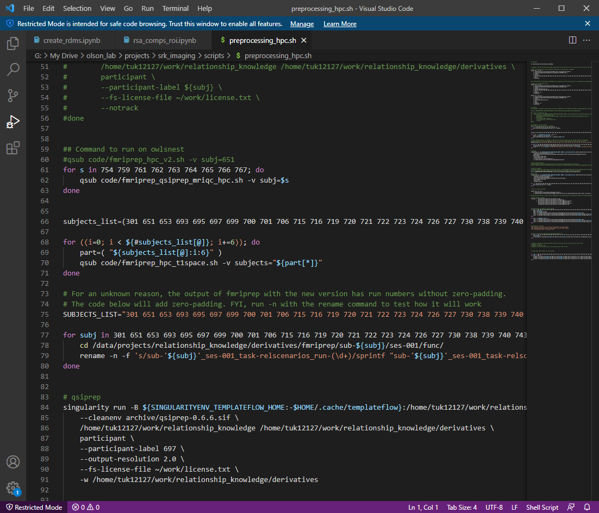
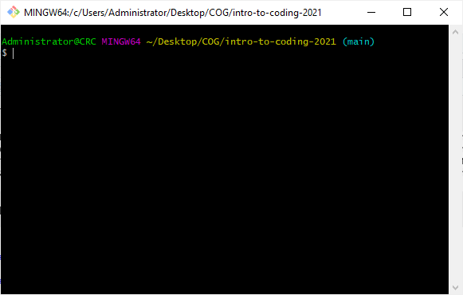
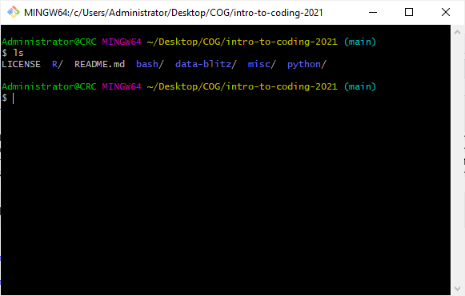
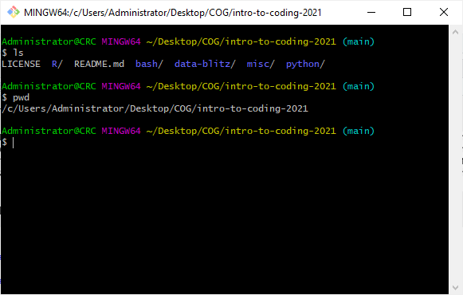
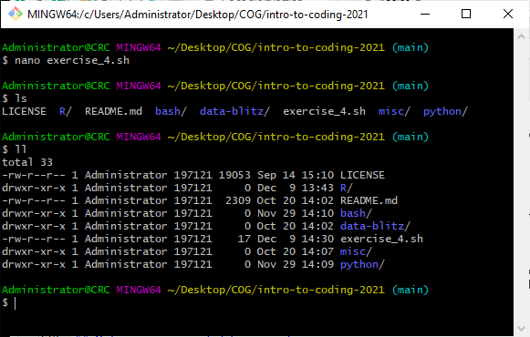
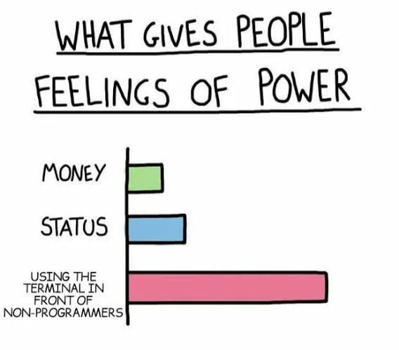

# Introduction

## Learning Objectives
- Practice coding syntax
- Learn basic coding operations (if-statements, for loops, etc.) and concepts (paths, directories, etc.)
- Learn how to troubleshoot


## What is bash?
Bash is a programming language that is used in a command line. There are many different types of programming languages. Bash is commonly used on Macs, Linuxs, and now even PCs. It is similar to C-shell languages like csh, tcsh, and Apple's zsch. 


## Preparing for the tutorial
### Mac users
The terminal (aka command line) is how you will be interacting with bash. Newer Macs use zsch. In my experience, zsch is very similar to bash and you probably do not need to switch to bash for this tutorial. If you wanted to, you would have to:

1. open the terminal (press command + space and then search for "terminal")
2. type "bash"
3. hit enter

### PC users
I liked to use the [gitforwindows](https://gitforwindows.org/) bash implementation. Download this programming and install like you would any other program on windows. Then search for the "Git Bash" program. 


## Using a text editor
As we'll learn throughout the week, there are a variety of different ways to write code. One way is to use an integrated development environment (IDE), such as this tutorial which was written in RStudio or Jupyter which was used to create the python tutorial. Both of which we'll demonstrate how to use later in the week. Another way to edit and write is to use a text editor. This can even just be a notepad document. However, some more fancy software exists which makes it very helpful to write code by stylizing code so that it is easier to read, like the example below.



I would recommend [Visual Code Studio](https://code.visualstudio.com/). As you work through this tutorial, type your example code, solutions, and anything else you are entering in to the terminal to the text editor as well. That way when you run a bit a code today, you'll have a copy of it for future use. Probably the most useful part of coding is reusability, which is where the text editor comes in. You can also add comments to code to make notes on what a certain command does. This can be done by adding a `#` at the beginning of a line. Everything on the line after the "#" will not be executable as code. Try using comments to describe the commands you use throughout the tutorial.

At the end of the tutorial we will also use a text editor to create a script. Scripts allow us to write out a series of commands or instructions that is then carried out by the program (today, in bash) and can be executed many times as opposed to being utilized in a single instance.


# Basic Bash Commands

## Terminal
The terminal is a way of interacting within your computer that does not require a graphic user interface (GUI). In the olden times, computers did not have a mouse, desktop, folders, and program icons. If you wanted to do something on a computer, you had to give the computer very specific instructions (sometimes referred to as commands). If the terminal is the "old" way of doing things, why do people still use the terminal today? One reason, and a point we will stress throughout the bootcamp, is for automation. When you interact with a computer via traditional ways, you will have to repeat very redundant motions. Let's say you want to rename 100 files. You will have to right click on each one, hit "rename", and then type out the new name of the file, all while making small but infuriating mistakes at each of these steps. Repeating this process over and over you might also make small mistakes that can be harder to catch later, such as if you were to add an extra "a" somewhere. With the terminal, and with coding in general, we can create a set of commands, test it on a couple of files, and then run them on all of the other files using a script or our text file. Then, if we ever have to do something similar in the future, we will have that code ready, and not have to do redundant things again. 




#### Exercise 0
Try creating your first bash text file now. Open Visual Code Studio, create a new file, name it "bash_exercises.sh". The ".sh" extension tells the computer this is a bash script. You should also specify that this is a bash script by adding `#!/bin/bash` to the first line of the document. This is a good habit to have when writing scripts so you know what language the script was written in.


## Listing
When you open a folder using the GUI on your computer, you can immediate see the files that are inside. In the terminal you will have to give it a command to see what is inside (ignore this con, the pros are coming soon). The command to "list" the contents of the **current directory** is:

```{eval=FALSE}
ls
```


But what is a "current directory", or even a regular "directory". You can think of a directory as a folder, and the current directory would be the current folder. Okay, so now we can see what is in our current directory, but where are we anyways?! Well, if we were using our computer the traditional way, we might have a bar at the top of our finder window that lists the entire address of where we are. In the terminal, we will also have to provide the command to Print the Current Directory.

```{eval=FALSE}
pwd
```



# Directories
Another word you might see used is "subdirectories", which is just a directory within a directory. Directories are relative and so any given directory can be a subdirectory, depending on your point of reference. One import directory to know is the **home directory**. Computers have a default directory where you generally start once you open the terminal.If you ever find yourself somewhere and want to go to the home directory, just used the "change directory" command:

```{eval=FALSE}
cd
```

#### Exercise 1
Use the commands we have learned to find the path (location) of the home directory. A path (or filepath) is the entire series of directories and subdirectories leading to a file or folder.

[Click for solution](https://github.com/TU-Coding-Outreach-Group/intro-to-coding-2021/blob/main/bash/solutions/ex1.sh)


## Navigating Directories

### Know where you are going
To navigate through directories, we can used the `cd` command and input a subdirectory to go to there. For example, use the following command to go to the "Desktop" from the home directory:

```{eval=FALSE}
cd Desktop
```

Now when we hit "ls" we can see everything on our desktop:
~[](images/desktop.PNG)

### Going to where you need to go
Now that you know the **`ls`, `cd`, and `pwd`** commands, you can navigate through your computer just like you would with the finder (on a mac) or the file explorer (on a PC).

#### Exercise 2.a
Navigate to the directory that your COG bootcamp materials are in using the terminal.

**Note:** Now is a good time to start using the text editor. The exercises you do today may be relevant to the rest of the bootcamp, so it is a good idea to keep a record of all the commands and actions you took to play around with the data. Add a comment to the script to note that the following code is for Exercise 2.a. Then write the solution for this exercise below the comment.

[Click for solution](https://github.com/TU-Coding-Outreach-Group/intro-to-coding-2021/blob/main/bash/solutions/ex2a.sh)


### Getting from A to B
In the previous exercise, did you find yourself repetitively using the **`cd`** command to go through various directories. One rule of thumb for coding is that if something is repetitive, there is probably a more efficient way to do it. In this case, we can give the **`cd`** command a path instead of a single directory to navigate to. 

#### Exercise 2.b
Start at your home directory and navigate to the "bash" subdirectory within the COG bootcamp directory. Don't forget to add this code to your text file. 

[Click for solution](https://github.com/TU-Coding-Outreach-Group/intro-to-coding-2021/blob/main/bash/solutions/ex2b.sh)


## Managing Directories

### Creating new directories
To create a new directory, use the "make directory" command while providing a name to the new directory:
```{eval=FALSE}
mkdir test_directory
```
Here, we used an underscore to space out the words "test" and "directory". This is because navigating through directories that have a space or other weird characters in the name can be tricky. So to keep things simple, coders often use underscores instead of spaces.


### Creating subdirectories
We can also create subdirectories by giving a path and then the new subdirectory. The syntax for this is:
```{eval=FALSE}
mkdir path/to/new/filename
```

#### Exercise 2.c
Create a subdirectory within the new "test_directory" and name it "test_subdirectory".

[Click for solution](https://github.com/TU-Coding-Outreach-Group/intro-to-coding-2021/blob/main/bash/solutions/ex2c.sh)


### Moving things
We can use the "move" command to move directories and other files. Here is the syntax for that:
```{eval=FALSE}
mv path/to/file path/to/new/location
```

#### Exercise 2.d
Move the "test_subdirectory" directory back one level, so that it is in the "bash" directory.

[Click for solution](https://github.com/TU-Coding-Outreach-Group/intro-to-coding-2021/blob/main/bash/solutions/ex2d.sh)


### Renaming things
The move command can also be used to rename things. Normally, we would use the move command to move something to somewhere else by providing a path to the new location. To rename something, we won't provide a new path, but just the new name, like so:
```{eval=FALSE}
mv old_filename new_filename
```

#### Exercise 2.e
Rename "test_subdirectory" as "subject_data"

[Click for solution](https://github.com/TU-Coding-Outreach-Group/intro-to-coding-2021/blob/main/bash/solutions/ex2e.sh)


### Copying things
The copy command can be used to copy files from one location to another location with the following syntax:
```{eval=FALSE}
cp path/to/original path/to/new/location
```

#### Exercise 2.f
Copy over the subject data, in the "log", from the "misc" workshop directory into the "subject_data" subdirectory in the "bash" directory.

**Note:** In order to copy a directory and its entire contents, you must use the `-r` flag like so:

```{eval=FALSE}
cp -r path/to/original path/to/new/location
```

Flags are different and additional options for a command. The `-r` flag here stands for "recursive", so we are having the computer copy the directory and its entire contents as opposed to a single empty folder or a single file.

**Hint:** There are multiple ways to solve this exercise. First, you should note the correct paths. It might seem complicated, but just keep in mind that only two inputs are needed for this command. Second, you can either copy all of the individual subject data using an `*` wildcard which tells bash "pull all these things". Or you can copy over the higher level directory and then rename it.

[Click for solution](https://github.com/TU-Coding-Outreach-Group/intro-to-coding-2021/blob/main/bash/solutions/ex2f.sh)


#### Think!
When do you end a path with the `/` symbol and when do you not? What would happen if you used the `mv` command to move something into the current directory where there is already a file of that name? How would this change if you use or do not use slashes? Discuss with other students and your TA.


### Removing things
Removing files can be done by providing the path the file you wish to remove. Again, if you wish to remove a directory, you used use the `-r` flag. 
```{eval=FALSE}
rm path/to/file
```

**Note:** Be **very** careful when you remove a file or directory using the terminal. If you've deleted files from your computer before, they generally end up in a separate "Trash" folder for a certain amount of time. THIS IS NOT THE CASE WHEN YOU REMOVE FILES USING THE TERMINAL. Files removed via the terminal are gone. Forever. 

#### Exercise 2.g
Remove the old test_directory folder.

[Click for solution](https://github.com/TU-Coding-Outreach-Group/intro-to-coding-2021/blob/main/bash/solutions/ex2g.sh)


# If-statements
Now that we know some basic commands, we can get to more complicated things. If-statements allow us to do something if certain a certain condition is met. The syntax for this is:
```{eval=FALSE}
if logical_argument; then
  do something
fi
```

The logical arguments used here can be a variety of things. One thing you can use it for in data management is to see whether certain files exist. The following command will check to see whether a csv exists for a particular subject.
```{eval=FALSE}
if (-e subject_data/subj_ID.csv); then
  echo "The data exists!"
fi
```

## Elif
We can also add additional conditions. These kinds of situations involve something along the lines of "if this do this, or if that do that, else do this."
For example, maybe we forgot how we named our files. Let's try a couple of different file names, and if those don't work, we'll have it printed out that we're failures.
```{eval=FALSE}
if (-e subject_data/DE249/DE249_dbdm_run_01.csv); then
  echo "The first one was right!"
elif (-e subject_data/DE249/DE249_dbdm_run_1.csv); then
  echo "The second one was right!"
else
  echo "The file does not exist."
fi
```

The `-e` is a flag, which tells the command to do something specific. In this case `-e` asks "does this exist".

# For Loops
For loops allow us to repeat a set of commands. This is very useful when you want to do the same thing for a bunch of subjects. The syntax is:
```{eval=FALSE}
for {thing} in {list_of_things}; do
  do this_to ${thing}
  and this_to ${thing}
  and that_to ${thing}
done
```

`thing` here becomes a variable. In order to reference a variable, you need to use the correct syntax, which is to have a `$` in the beginning. It is also a good idea to have the whole variable name in curly brackets `{}`. If you did not use this syntax and just used `thing` instead, bash would think this is a folder called "thing" in the current directory.


#### Exercise 3
Use an if-statement in combination with a for loop to check whether subjects DE201-DE210 have the appropriate behavioral data.

** Hint:** To complete this exercise, you will have to use the most important skill you will learn today. Google! Try to articulate the problem in a sentence and then google it. See if there are solutions already on line that you can just copy and modify. Outside of Google discuss and share helpful links with your group and your TA. What are some different ways to solve this exercise?

[Click for solution](https://github.com/TU-Coding-Outreach-Group/intro-to-coding-2021/blob/main/bash/solutions/ex3.sh)


# Writing Scripts
Scripts are just bits of code that do things in one executable document. In this tutorial we prepped some data that we will play around with for the rest of the bootcamp. But I forgot that there is a whole second batch of participants whose data we need to prep. 


## Making an executable script
To run a script, we can save the file and then use bash to run all the commands in one command, rather than use copying and pasting each command into the terminal. The make a script executable, we need to change some permission settings with the file, and then run it in the terminal. Use the steps below to make and run the script you created in Exercise 4.

1. Save the script as a ".sh" file. You can name it whatever you want, but try not to put any spaces or special characters into the title.
2. Navigate to where the script is in the terminal.
3. Check the permissions of the file, this can be done by using the `ll` or `ls -l` command:

4. Change the permission to make the file executable by using the code below.
```{eval=FALSE}
chmod u+x bash_exercises.sh
```
5. Run the script using the "bash" command.
```{eval=FALSE}
bash bash_exercises.sh
```


#### Exercise 4: Advanced!
Modify the for loop if-statement to check whether the csv data exists for all subjects. We only checked for the first 10 subjects before. Make sure all of your paths are correct. If you do not want to run certain commands (like the mkdir commands in the beginning), comment them out (add a `#` at the beginning of the command).

[Click for solution](https://github.com/TU-Coding-Outreach-Group/intro-to-coding-2021/blob/main/bash/solutions/ex4.sh)


# Preparing for the rest of the bootcamp

## Installing other software

### Python - Anaconda
[Installation instructions](https://docs.anaconda.com/anaconda/install/index.html)

### R - RStudio
[Install R](https://cran.rstudio.com/)

[Install RStudio](https://www.rstudio.com/products/rstudio/download/#download)

# Conclusion


# Extra

## Installing other software and packages
### Python
[Anaconda Installation](https://www.anaconda.com/products/individual#Downloads)

### R
[See instructions on R day page](https://github.com/TU-Coding-Outreach-Group/intro-to-coding-2021//tree/main/R)


## Symbolic links

## Saving outputs to files

## Grep

## Searching for files/filepaths


# Additional Resources
- [Software Carpentry](https://swcarpentry.github.io/shell-novice/)


